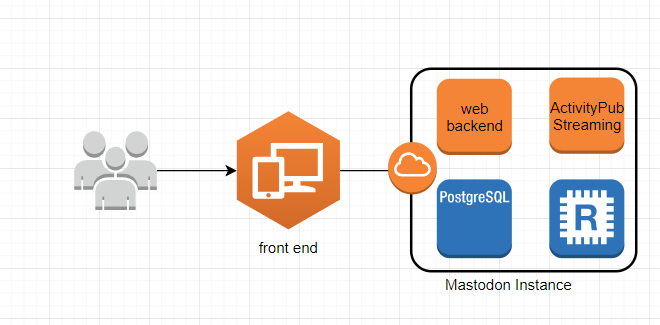
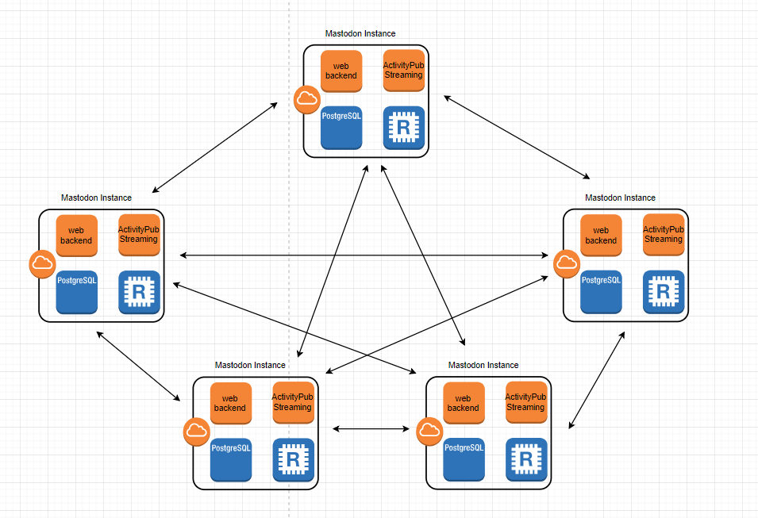
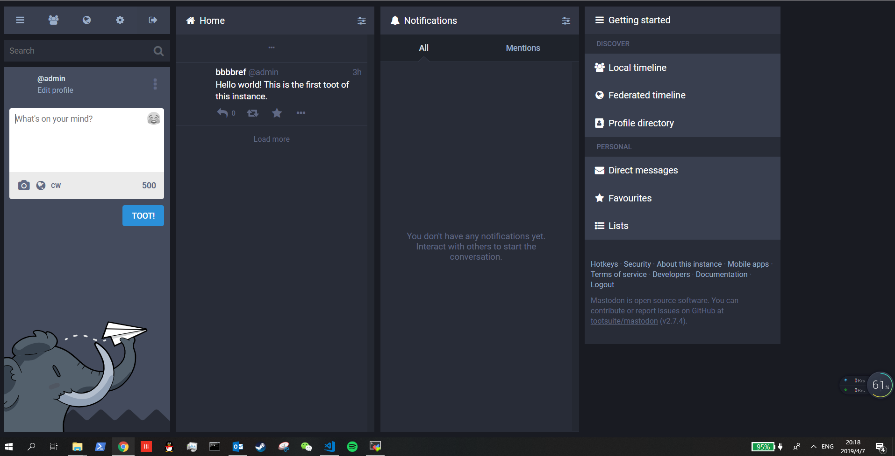

# Case study - Mastodon
## 1. Technology and Platform
Mastodon is a free, open-source social network server based on ActivityPub. Follow friends and discover new ones. Publish anything you want: links, pictures, text, video. All servers of Mastodon are interoperable as a federated network, i.e. users on one server can seamlessly communicate with users from another one. This includes non-Mastodon software that also implements ActivityPub!  
### a. Coding language
The project is using different coding language for different modules: Ruby on Rails powers the REST API and other web pages, React.js and Redux are used for the dynamic parts of the interface and Node.js powers the streaming API.  
Ruby on Rails is a web application development framework written in the Ruby programming language. It is designed to make programming web applications easier by making assumptions about what every developer needs to get started. It allows users to write accomplishing more than many other languages and frameworks. I do think the same languages would be used if the project was started today. Because it's a framework mainly for web application development and is much easier to learn and code than some huge framework like java spring. Compared to Ruby on Rails, I'm more familiar with Python Django. But Django doesn't have much documentation and is less popular than Ruby on Rails. So I think Ruby on Rails is a better choice.  
### b. Building system
This project mainly use Bundle and Yarn to build all the Ruby and JavaScript dependencies. Before building this whole project, you need to set up Ruby and Node.js environments. Also you need to set up PostgreSQL, Redis and Nginx.  
### c. Frameworks or libraries used
#### Ruby  
* `haml`, a templating language  
* `devise`, for authentication  
* `doorkeeper`, for acting as an OAuth 2 provider  
* `paperclip`, for file uploads and attachments  
* `sidekiq`, for background processing  

#### JavaScript  
* `immutable`, for immutable data structures  
* `react`, for rendering the dynamic web application  
* `react-redux`, for managing React state  
* `react-router-dom`, for navigation within React  
* `react-intl`, for localizations within React  
## 2. Testing
This project is using the circleci as their CI platforms. The circleci will start 4 jobs for every commits. One job is doing the i18n checks and other jobs check the instalation of Ruby and Node.js dependencies and build the whole project.  
This project uses unit test and system test to test their functionality, however I didn't find anything like the code coverage metrics to ensure the test is meaningful.    
## 3. Software architecture
### a. How would you add/edit functionality to this project? How would one use this project from external projects?
Here's an overview of the whole code structure. I can edit or add functionality to this project based on description below:  
#### Ruby
| Path             | Description                                             |
| ---------------- |:-------------------------------------------------------:|
|`app/controllers` | Code that binds business logic to templates             |
|`app/helpers`	   | Code that can be used from views, i.e. common operations|
|`app/lib`	       | Code that doesn’t fit in the other categories           |
|`app/models`	   | Code that represents data entities                      |
|`app/serializers` | Code that generates JSON from models                    |
|`app/services`	   | Complex logical operations involving multiple models    |
|`app/views`	   | Templates for generating HTML or other output           |
|`app/workers`	   | Code that executes outside the request-response cycle   |
|`spec`	           | Automated test suite                                    |
#### JavaScript
|Path	                   | Description                                             |
| ------------------------ |:-------------------------------------------------------:|
|`app/javascript/mastodon` | Code for the multi-column React.js application          |
|`app/javascript/packs`	   | Code for non-React.js pages                             |
#### CSS and other assets
|Path	                   | Description                                             |
| ------------------------ |:-------------------------------------------------------:|
|`app/javascript/images`   | Images                                                  |
|`app/javascript/styles`   | Code that turns into CSS via Sass                       |
This project is only usable as a standalone program.  
### b. What part of the softwares are asynchronous?
Ruby on Rails is actually using sidekiq to run most of the jobs in the background. Then most of the services this project provide to users is asynchronous. Sidekiq is a simple, efficient background processing for Ruby. Sidekiq uses threads to handle many jobs at the same time in the same process.  
### c. System diagram
Here's an overview of the Mastodon Instance:  
  
One Mastodon Instance consists several different modules: Nginx, PostgreSQL database, Redis, a web backend program written on Ruby and a streaming module developed on Node.js. The Nginx acts as a proxy which will handle all the HTTP requests from users. The PostgreSQL db is used for users' data storage. The Redis is used to cache data and to store queued tasks. The web application powers the REST API and all the web pages. The streaming module is used to GET or POST informations between different Mastodon instances.  
Different Mastodon Instances can connect with each other and constructs a federated network:  
  
Mastodon Instance can be deployed by anyone on any servers. All Mastodon Instances then can communicate with each other via ActivityPub protocol. Users can choose any one Mastodon Instance and register an account on it. Then users not only can view all the information published by users from this instance, but also can get information from other different instances.  
### e. What architectural patterns are used?
For a single Mastodon instance, the project is using the simpel client-server architecture. For the whole federated network, the project is actually a peer-to-peer network architecture or server-server architecture.  
## 4. Analyze two defects in the project
[issue #9435](https://github.com/tootsuite/mastodon/issues/9435) mentions that once a certain threshold of HTTP 405 responses is reached (~5-10), Mastodon should remove the end-point from its list of federated end-points. HTTP response 405 means that the end-point is signaling that it's not federated - in accordance with the ActivityPub spec. The actual behaviour should be that Mastodon keeps pushing new Activities to end-points that are replying with HTTP 405 Method not Allowed responses. This issue requires adding functions in handling the HTTP 405 response.  
[issue #7943](https://github.com/tootsuite/mastodon/issues/7943) mentions that somtimes the count of auth errors is incorrect. This is because in the code, the number of errors reported is always n+1. So this issue need to alter the logic in the code.  
## 5. Demo
I successfully install my own Mastodon Instance on a AWS EC2 VM. In order to let people visit my own Mastodon instance, I set up a domain for the AWS EC2 and then people can visit this instance by url: <https://www.brefcube.com>.
